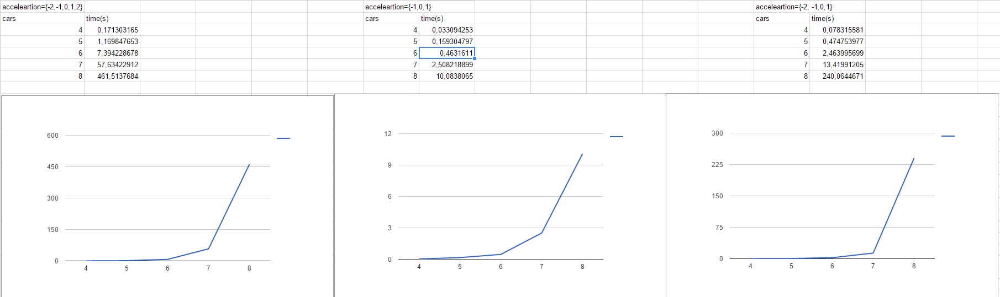

## MEASURING TIME FOR THE ALGORITHM

# The tests beneath include the following cases:
    + acceleration values are {-2, -1, 0, 1, 2}
    + acceleration values are {-1, 0, 1}
    + acceleration values are {-2, -1, 0, 1}

# You can also find it here:

  https://docs.google.com/spreadsheets/d/1ucaHf5jChi1xIABxMcvCKJmhdzKfEUCEC1iG-6V-Mz8/edit?usp=sharing
